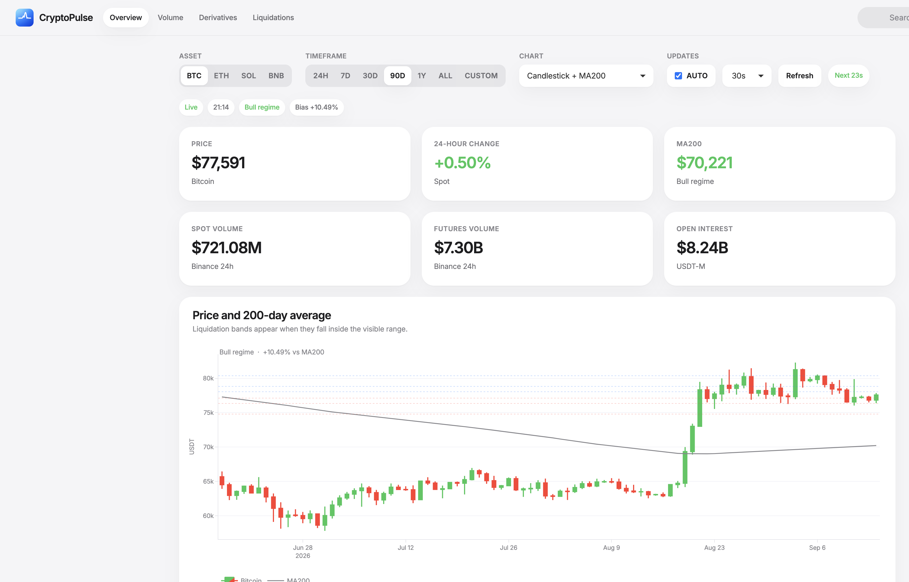
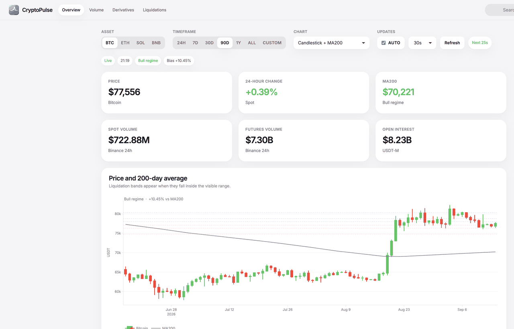

# CryptoPulse


## Welcome! 

Welcome! 🎉 Willkommen! 🎊 Bienvenue! 🎈

Thank you for visiting the `CryptoPulse` project repository. This README file is designed to provide you with essential information about our dashboard. Whether you're here to dive into specifics or just browsing to learn more, feel free to navigate using the links below:

-   [CryptoPulse](#crypto-pulse)
    -   [Welcome!](#welcome)
    -   [Who Are We?](#who-are-we)
        -   [Project Summary](#project-summary)
        -   [Motivation and Purpose](#motivation-and-purpose)
    -   [Features of CryptoPulse](#features-of-crypto-pulse)
    -   [How Does It Work?](#how-does-it-work)
    -   [Get Started](#get-started)
    -   [Contribute](#contribute)
    -   [Data Sources and Licensing](#Data-Sources-and-Licensing)
        -   [Data Sources](#Data-Sources)
        -   [Licensing](#Licensing)
    -   [Contact Us](#contact-us)

## Who Are We? 

We are a team of data scientists and developers passionate about finance and technology, particularly in the cryptocurrency space. Our expertise in data visualization and interactive platforms drives the development of `CryptoPulse`.

### Project Summary 

`CryptoPulse` is an advanced analytical dashboard designed to provide real-time insights into cryptocurrency markets, tailored for traders, financial analysts, and enthusiasts interested in crypto market trends.

### Motivation and Purpose 

**Target Audience:** Traders, financial analysts, cryptocurrency enthusiasts, and anyone interested in understanding and navigating the cryptocurrency market.

Cryptocurrencies, characterized by their volatile nature, present a complex landscape for traders and financial analysts. `CryptoPulse` aims to empower these professionals by providing a tool that offers real-time insights into market trends and dynamics, enabling them to make informed trading decisions. By leveraging our dashboard, users can analyze historical data patterns, track price movements, and understand market sentiments, all of which are crucial for optimizing investment strategies and minimizing risks.

## Features of CryptoPulse



`CryptoPulse` offers various features to explore cryptocurrency data:

-   **Real-time price updates** from Binance public APIs, with local Kaggle history as fallback
-   **Spot volume** for BTC and ETH, including 24h notional volume and historical trends
-   **Futures / derivatives volume** plus USDT-M open interest and account long/short mix
-   **200-day moving average** overlaid on the core price chart, with bull/bear regime and deviation
-   **Estimated liquidation levels** showing long/short clusters and key leverage lines (10x-100x)
-   **Timeframe switching** (24H, 7D, 30D, 90D, 1Y, ALL, or custom dates) across a responsive dashboard
-   **BTC, ETH, SOL, and BNB** with the same spot, futures, MA200, and liquidation views
-   **Auto-refresh** with a live toggle, 15/30/60 second interval, countdown, and manual refresh

## How Does It Work? 

The dashboard leverages Shiny for a responsive and interactive user interface. Users can select different cryptocurrencies, adjust time ranges, and access a variety of analytical tools.



-   **Cryptocurrency Selection:** Users can select the cryptocurrency of interest, such as Bitcoin or Ethereum, to view specific data.
-   **Date Range Selection:** A date slider allows users to specify the time range for the data, enabling historical market trend analysis.
-   **Market Metrics Visualization:** The dashboard displays various market metrics such as open, high, low, close prices, volume, and daily price changes. This data is presented in various formats including time series plots, bar charts, and value boxes.
-   **Interactive Time Series Plot:** The core feature is the interactive plot which updates real-time as users adjust the parameters. It showcases the selected price metric over the chosen period.

[CryptoPulse Demo Video](https://github.com/iris0614/CryptoPulse/blob/main/video/CryptoPulse.mp4)

## Get Started 

To run `CryptoPulse` locally:

1.  **Clone the repository:**

    ``` bash
    git clone git@github.com:iris0614/CryptoPulse.git
    ```

2.  **Navigate to the project directory:**

    ``` bash
    cd CryptoPulse/src
    ```

3.  **Run the application:**

    -   Launch the application using R or RStudio.
    -   Open the application file (`app.R`) and then click the `Run App` button at the top right-hand side of RStudio.
    -   This will typically launch the application in your default web browser at <http://127.0.0.1:6218/>.

## Deploy (open in a browser, no clone required)

CryptoPulse is an **R Shiny** app and needs a persistent server. Vercel and Netlify cannot host it. Use Docker or Render.

**Docker (local or any VPS):**

```bash
docker compose up --build
```

Then open <http://localhost:3838/>.

**Render (one-click web URL):**

1. Push this repo to GitHub.
2. In [Render](https://render.com), create a new Web Service and pick this repository.
3. Runtime is Docker (`render.yaml` is already in the repo).
4. After the first deploy, share the `*.onrender.com` URL.

**shinyapps.io:**

```r
rsconnect::deployApp("src")
```

`vercel.json` is included only to fail fast if someone tries to deploy this Shiny app to Vercel.

## Contribute 

We welcome contributions from the community! Whether it's enhancing the dashboard, adding new features, or fixing bugs, your input is highly appreciated. Please review our [Contribution Guidelines](CONTRIBUTING.md) for more information.

## Data Sources and Licensing 
### Data Sources 

Live market metrics are fetched from public exchange APIs and refreshed in the dashboard:

-   **Binance Spot** (`api.binance.com`) for BTCUSDT / ETHUSDT / SOLUSDT / BNBUSDT prices, 24h change, and spot volume
-   **Binance USDT-M Futures** (`fapi.binance.com`) for derivatives volume, open interest, and long/short account ratios
-   **CoinGecko** for an optional global 24h volume cross-check
-   **Local Kaggle history** (`👛🤑💰 Bitcoin & Ethereum prices (2014-2024)`) as the historical backbone and offline fallback. The dataset is [here](https://www.kaggle.com/datasets/kapturovalexander/bitcoin-and-ethereum-prices-from-start-to-2023?select=BTC-USD+%282014-2024%29.csv)

Liquidation bands are **model estimates** (open interest × common leverage buckets × recent volume-weighted entries), not exchange-reported force-order heatmaps.

### Licensing 

`CryptoPulse` is released under the MIT License. See the [LICENSE](LICENSE.md) file for details.

## Contact Us 

For any questions or suggestions, feel free to [open an issue](https://github.com/your-username/CryptoPulse/issues/new) on this repository or contact one of our team members directly.

Thank you for visiting our project! We hope `CryptoPulse` helps you navigate the dynamic world of cryptocurrencies more effectively.
